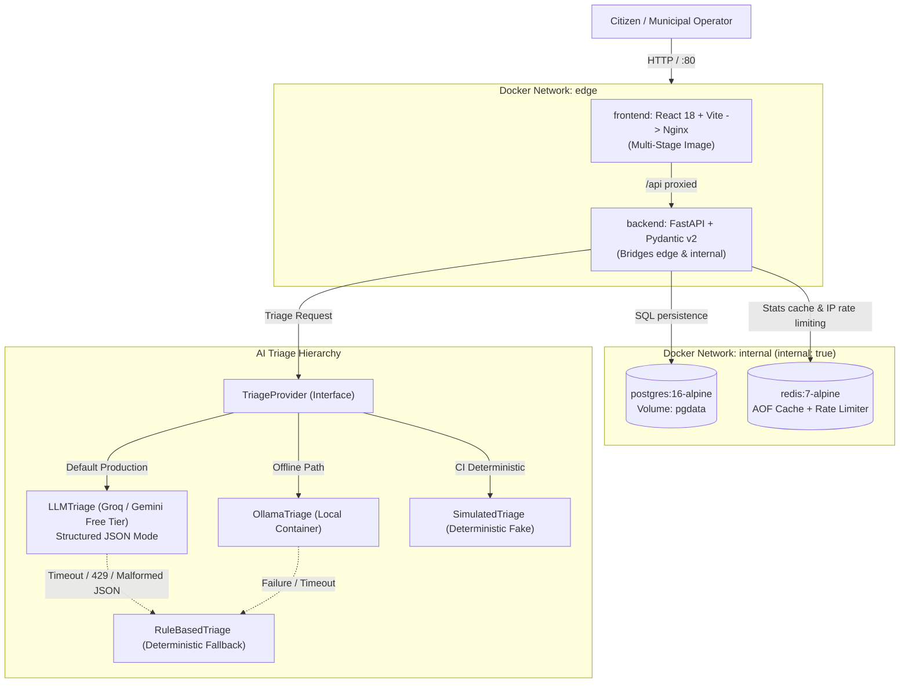

# CivicPulse — Municipal Complaint Intake, Triage & Operations Platform

[](https://github.com/civicpulse/civicpulse/actions/workflows/ci.yml)
[](compose.yaml)
[](k8s/base/hpa.yaml)
[](LICENSE)

CivicPulse is an end-to-end municipal complaint intake, triage, and operations platform designed to solve urban service bottlenecks. Citizens submit free-text complaints in natural language (including Urdu-influenced English). CivicPulse validates inputs, triages urgency and category via resilient AI models with deterministic rule fallbacks, caches duplicate reports, persists records durably in PostgreSQL with Alembic migrations, and surfaces tickets in a live operations dashboard.

---

## 1. System Architecture

The following diagram illustrates the network segmentation and triage hierarchy of CivicPulse:



---

## 2. API Contract Specification (§2.2)

| Method | Path | Status Codes | Description & Behavior |
| :--- | :--- | :--- | :--- |
| `POST` | `/api/complaints` | `201`, `400`, `429` | Validates complaint, checks distributed IP rate limiter, executes AI triage, persists to DB, and invalidates stats cache. |
| `GET` | `/api/complaints/{id}` | `200`, `404` | Retrieves single complaint by UUID. |
| `GET` | `/api/complaints` | `200` | Lists complaints with filtering (`category`, `priority`, `status`) and pagination (`page`, `page_size <= 100`). |
| `PATCH` | `/api/complaints/{id}/status` | `200`, `404`, `409` | Transitions complaint status via explicit state machine. Returns `409 Conflict` naming invalid transitions verbatim. |
| `GET` | `/api/stats` | `200` | Aggregates counts by category, priority, and status. Redis-cached with 30s TTL. Emits `X-Cache: HIT` or `MISS`. |
| `GET` | `/api/meta/providers` | `200` | Observability surface returning active triage provider and sliding window of last 20 triage events. |
| `GET` | `/health` | `200` | Liveness probe verifying process is alive. **Never** touches database or Redis. |
| `GET` | `/ready` | `200`, `503` | Readiness probe. Returns `200` only if both Postgres and Redis are reachable; `503` naming failed dependency. |
| `GET` | `/metrics` | `200` | Prometheus text metrics: request count, request duration histogram, triage latency, and fallback counters. |
| `GET` | `/api/docs` | `200` | Interactive OpenAPI / Swagger UI documentation. |

---

## 3. Quickstart: Clean Clone to Running Stack (§1.4)

Run the entire platform locally with seeded data using one command:

```bash
# 1. Clone repository
git clone https://github.com/civicpulse/civicpulse.git
cd civicpulse

# 2. Copy environment template
cp .env.example .env

# 3. Start multi-container stack with network isolation
docker compose up -d --build

# 4. Run database migrations and seed 32 realistic complaints
docker compose exec backend alembic upgrade head
docker compose exec backend python seeds/seed_complaints.py
```

### Accessing the Services
- **Operations Dashboard**: `http://localhost:80`
- **Interactive API Documentation**: `http://localhost:8000/api/docs`
- **Prometheus Metrics**: `http://localhost:8000/metrics`
- **Liveness & Readiness**: `http://localhost:8000/health` & `http://localhost:8000/ready`

---

## 4. Key Engineering Highlights

### 4.1 Resilient AI Triage & Fallback Guarantee
- **Hard Timeout**: 10-second cap on all upstream LLM calls.
- **Single Jittered Retry**: Retries transient 429 and 5xx errors once; never retries 400.
- **Fail-Safe Fallback**: Any failure triggers immediate fallback to `RuleBasedTriage`, tagging `triaged_by = "rules:fallback"`. Citizens never see a 500.
- **Content-Hash Caching**: Duplicate complaints are hashed using SHA-256 and cached in Redis for 24 hours.

### 4.2 Network Segmentation
- `edge` network connects `frontend` $\leftrightarrow$ `backend`.
- `internal` (`internal: true`) connects `backend` $\leftrightarrow$ `database` $\leftrightarrow$ `cache`.
- Provably isolated: `docker compose exec frontend ping database` fails, protecting civic data from internet-facing compromises.

### 4.3 Kubernetes Autoscaling (HPA v2 + VPA)
- Backend Deployment scales dynamically from 2 to 10 replicas under CPU load ($\ge 60\%$).
- Tuned scale-up and scale-down stabilization behavior to prevent flapping.
- VPA configured in recommender mode (`updateMode: "Off"`).

---

## 5. Screenshots & Evidence

### Submit Complaint View
The submission form captures free-text complaint, location, and optional contact. After AI triage, the returned category, priority, AI summary, and triage provider are displayed.

### Operations Dashboard
The dashboard provides paginated, filterable complaint listings with status transition controls. Invalid status transitions surface the server's 409 message verbatim.

### Stats & Cache Telemetry
The stats view renders aggregate counts by category, priority, and status. The `X-Cache` badge shows whether the response was served from Redis cache (HIT) or computed from PostgreSQL (MISS).

### Evidence Artifacts
| Evidence | Description | File |
| :--- | :--- | :--- |
| Branch Protection | GitHub branch protection ruleset screenshot | [`branch-protection.png`](docs/evidence/branch-protection.png) |
| CI Quality Gate | Red-to-green CI gate blocking then unblocking merge | [`ci-gate-red-green.png`](docs/evidence/ci-gate-red-green.png) |
| Merge Conflict | Deliberate merge conflict in triage keywords | [`merge-conflict.png`](docs/evidence/merge-conflict.png) |
| HPA Scaling | Horizontal Pod Autoscaler scale-out under load | [`hpa-scaling-chart.png`](docs/evidence/hpa-scaling-chart.png) |

---

## 6. Automated Verification & Pre-Flight Lint

Run the submission validation script from the repository root:
```bash
python scripts/check_submission.py
```

Run test suites:
```bash
# Backend pytest suite (>= 65% coverage)
cd backend && pytest tests/ -v --cov=app

# Frontend Vitest component test suite (7 tests)
cd frontend && npm run test
```

---

## 7. Architecture Decision Records (ADRs)
- [ADR 0001: Pluggable AI Triage Provider Interface](docs/adr/0001-provider-interface.md)
- [ADR 0002: Frontend Runtime Configuration via Reverse Proxy](docs/adr/0002-frontend-runtime-config.md)
- [ADR 0003: Immutable Deployments via Git Commit SHA](docs/adr/0003-deploy-by-sha.md)
- [ADR 0004: Personally Identifiable Information (PII) & Data Governance](docs/adr/0004-pii-and-data-governance.md)

---

## 8. Operational Runbook & Engineering Notes
- [Operations Runbook](docs/RUNBOOK.md)
- [Engineering Notes (Answering §5.2 Q1–Q8)](docs/ENGINEERING-NOTES.md)
- [AI Usage Disclosure](docs/AI-USAGE.md)
- [Triage Benchmarks](docs/TRIAGE.md)
- [Evidence & Captures](docs/evidence/README.md)
